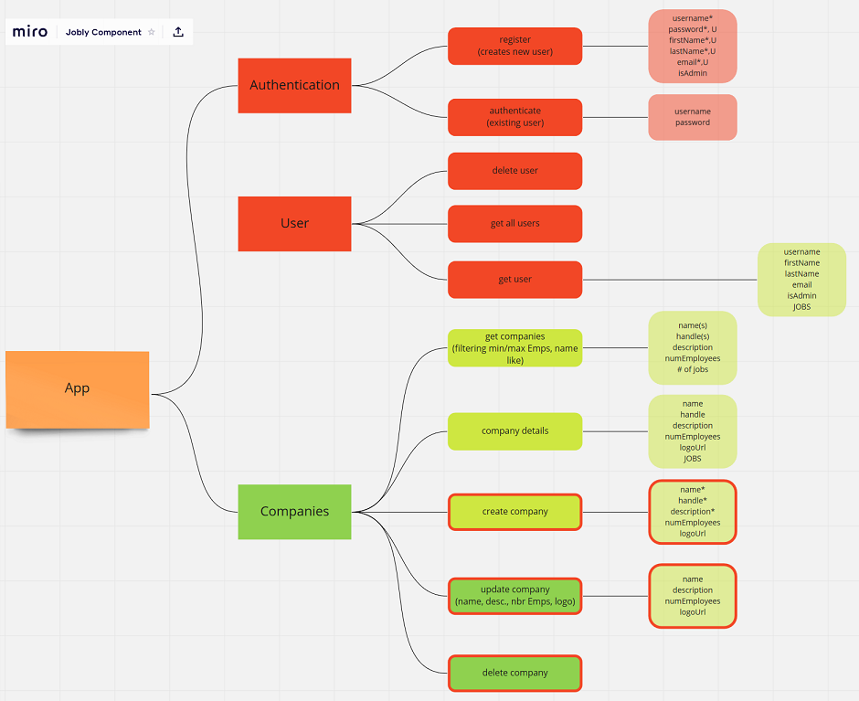

# sb_43-00-00_React-Jobly
 
## Technology Stack
- **Front-end**: ReactJS
- **Back-end**: NodeJS, provided

## Assignment Details

Build a react front-end to the provided Jobly backend. 

**Step Zero: Setup**

**Step One: Design Component Hierarchy**

Interesting. The step was completed, but it's helpfulness is debatable. The *Jobly Component Map* (below)followed the backend routes more. It helped to see the breadth of the routes that exist in the backend and it caused code exploration and familiarization. The components built do not resemble the component hierarchy.

 

**Step Two: Make an API Helper**

The API handler is a class that holds the methods that make the requests from the Jobly backend. 

The Jobly backend has a lot of functionality that will not get implemented in the frontend -- examples are adding a company, adding a position, altering the admin flag. The approach for this piece was to indentify all possbible routes from the backend and add them to the api class as comments / placecholders. The code was impletmented as the respective route was needed.

**Step Three: Make Your Routes File**

**Step Four: Companies & Company Detail**

**Step Five: Jobs**

**Step Six: Current User**

Ability for a user to sign up and for an existing user to sign in were created. Some error messaging was added to the sign up and sign in form. The only front-end validation that exists is the check that password and confirmation password match. The error messaging added is a start but by no means a complete solution.

Navigation components were adjusted and Sign In / Sign Up links only appear for unauthenticated users. The current username and a Sign Out link / button appear in the navigation once the user is authenticated (either by signing up or signing in).

Authenticated users are placed on the jobs listing page. 

**Step Seven: Using localStorage and Protecting Routes**

One of those tasks that sounds deceptively simple. A `useLocalStorage` hook was created and the user is correctly saved to localStorage with the `joblyUser` key. Problems occurred when the existing handling of state in `App` and `NavBar` were changed to the state maintained through `useLocalStorage`. `App` needs a state change in order to render and `NavBar` gets the user from `App`. A function to set use state in `App` is still passed to `AuthSignIn` and `AuthSignUp` components - and they now set the user in localStorage via `useLocalStorage`, set the user in `App` state with the passed function and finally redirect. 

Route Protection implemented on `companies/`, `companies/:handle`, and `jobs/` routes through the use of `useRouteProtection` hook. The `useRouteProtection` uses `useLocalStorage` hook to determine whether the visitor is authenticated and redirects unauthenticated visitors to the login page. The `useRouteProtection` hook was added as one of the first lines in components that require route protection.

`login` and `signup` pages are protected differently -- the pages are protected from visitors who are already authenticated.

**Step Eight: Profile Page**

**Step Nine: Job Applications**

**Step Ten: Deploy your Application on Heroku**

## Additional Details

**Enhancements**
- None.

**Difficulties**
- Just a lot all at once. 

